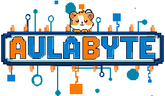

# 🎮 AulaByte: Fortaleciendo el Pensamiento Lógico

**AulaByte** es un videojuego educativo de plataformas 2D desarrollado como proyecto de grado para la **Licenciatura en Informática** de la **Universidad de Nariño**. 

El objetivo principal es fortalecer el pensamiento lógico en estudiantes de educación básica primaria mediante desafíos interactivos y mecánicas de gamificación.

---

## 🚀 Características
- **Motor de juego:** Desarrollado íntegramente en [Godot Engine](https://godotengine.org/).
- **Estética:** Pixel Art original inspirado en entornos educativos.
- **Pedagogía:** Basado en retos de secuenciación, lógica y resolución de problemas.
- **Multiplataforma:** Disponible para Windows y Android.

---

## 👥 Equipo de Desarrollo
- **Diana Cortés** ([dianacortez9924@gmail.com](mailto:dianacortez9924@gmail.com))
- **Mabel Costain** ([leidymabelcostain13@gmail.com](mailto:leidymabelcostain13@gmail.com))
- **Cristian Acosta** ([chrissar19@gmail.com](mailto:chrissar19@gmail.com))

**Asesor de proyecto:** [Jose Luis Romo]

---

## 📄 Licencia y Uso
Este proyecto se distribuye bajo la licencia **Creative Commons Atribución-NoComercial-CompartirIgual 4.0 Internacional (CC BY-NC-SA 4.0)**.

### Lo que puedes hacer:
- **Compartir:** Copiar y redistribuir el material en cualquier medio o formato.
- **Adaptar:** Mezclar, transformar y construir a partir del material.

### Bajo los siguientes términos:
1. **Atribución:** Debe dar crédito de manera adecuada a los autores originales y proporcionar un enlace a esta licencia.
2. **No Comercial:** No puede utilizar el material con fines comerciales.
3. **CompartirIgual:** Si remezcla, transforma o crea a partir del material, debe distribuir sus contribuciones bajo la misma licencia del original.

---

## 🛠️ Cómo ejecutar el proyecto
1. Descarga el repositorio.
2. Abre [Godot Engine](https://godotengine.org/) (versión 4.5 recomendada).
3. Importa el archivo `project.godot`.
4. ¡Dale a Play!